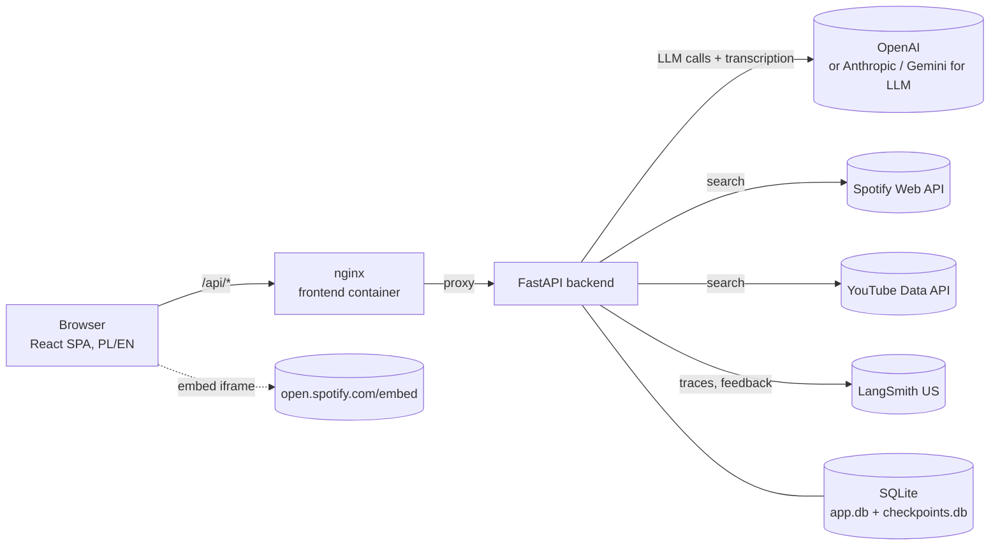
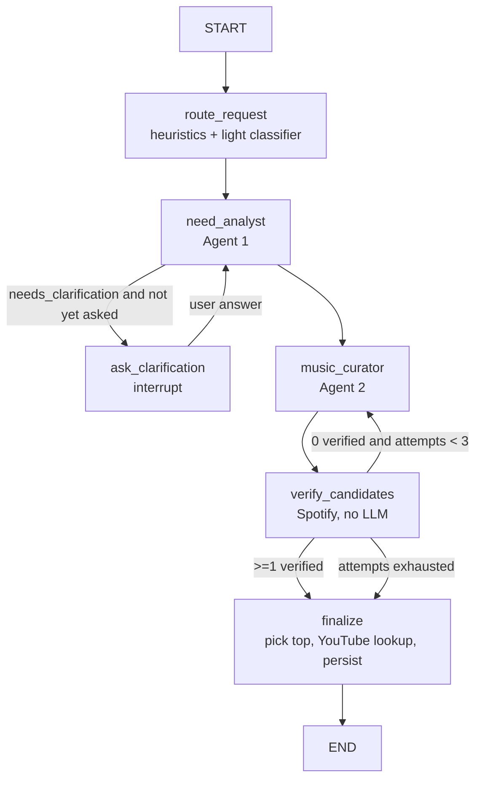

# Song Recommender — Technical Implementation Plan

Status: **approved draft** · Last updated: 2026-10-07 · Requirements: [requirements.md](requirements.md)

---

## 1. Tech stack

| Area | Choice | Why |
|------|--------|-----|
| Backend | Python 3.14.8, FastAPI, Pydantic v2, pydantic-settings, `uv` | Required stack; fast, typed, simple config. |
| Agent orchestration | **LangGraph** | Explicit multi-agent graph; `interrupt()` for the clarifying question; native LangSmith tracing. |
| Model abstraction | LangChain `init_chat_model` + `langchain-openai` (default), `langchain-anthropic`, `langchain-google-genai` | One `provider:model` string per tier; `with_structured_output`; `with_fallbacks`. |
| Observability | LangSmith (`langsmith` SDK), US region | Traces, metadata, threads, feedback, datasets and evals. |
| Persistence | SQLite + SQLAlchemy 2 (async, `aiosqlite`) + Alembic; `langgraph-checkpoint-sqlite` for graph state | Zero-ops for local hosting. |
| Music catalogs | Spotify Web API (Client Credentials, Search), YouTube Data API v3 (Search); `httpx`, `rapidfuzz` | Real, verified links; fuzzy matching of title and artist. |
| STT | OpenAI transcription API (`openai` SDK) behind an `STTProvider` interface | Uses the existing OpenAI key; no extra container. |
| Frontend | React 19, TypeScript, Vite, TanStack Query, React Router, Tailwind CSS, **react-i18next** | Required stack; PL/EN localization. |
| Testing | pytest, pytest-asyncio, respx, LangChain fake chat models; Vitest + React Testing Library | Offline, deterministic tests. |
| Quality | ruff, mypy; oxlint, Prettier | oxlint is the Vite template default (see ADR-00). |
| Runtime | Docker Compose: `frontend` (nginx) and `backend` | One command to run it locally. |

Exact model IDs are configuration, not code. The current OpenAI model IDs for the light tier, the heavy tier and transcription are checked against the OpenAI docs when steps 2 and 6 are implemented. They are then written into `.env.example`.

---

## 2. Architecture



### 2.1 Agent graph (LangGraph)



**Nodes**

| Node | Kind | Tier | Output |
|------|------|------|--------|
| `route_request` | Heuristics + LLM | light | `RoutingDecision{complexity, need_analyst_tier, curator_tier, reasons}`. Heuristics (length, contradiction markers, transcript) can skip the LLM call when the result is obvious. |
| `need_analyst` (Agent 1) | LLM, structured output | from routing | `NeedProfile` (below) |
| `ask_clarification` | `interrupt()` | — | Pauses the graph; the API returns the question (in the UI locale). Runs at most once. |
| `music_curator` (Agent 2) | LLM, structured output | from routing; **heavy on retry** | 5 ranked `SongCandidate`s and a user-facing explanation for each, in the UI locale. The prompt includes excluded tracks and the candidates rejected so far. |
| `verify_candidates` | Deterministic tool | — | Spotify search for each candidate, with fuzzy matching (title and artist ≥ 85) and the exclusion filter. Produces `verified[]` and `rejected[]` with reasons. |
| `finalize` | Deterministic tool | — | Picks the highest-ranked verified candidate and runs the YouTube lookup (cache first). If something is not verified, uses search URLs flagged `verified=false`. Persists the result. |

**Escalation rules**
- A structured-output validation failure on light is retried once on heavy.
- If a curation attempt has 0 verified candidates, the next attempt runs on heavy with feedback about the rejected candidates. At most 3 attempts.
- Each escalation is recorded in state and in the trace metadata.

**Language handling**
- The agents reason internally in English: the Need Profile fields and rationales are in English, so traces are consistent and comparable across locales.
- Only the user-facing text is generated in the UI locale (`pl` or `en`), as dedicated fields: `need_summary_localized`, `clarification_question`, `explanation`. The locale is passed into the state and the prompts.

### 2.2 Core schemas (Pydantic)

```python
Locale = Literal["en", "pl"]

class NeedProfile(BaseModel):
    summary: str                      # one-sentence restatement of the need (English)
    summary_localized: str            # the same in the UI locale, shown to the user
    emotions: list[str]               # e.g. ["tired", "quietly hopeful"]
    energy: float                     # 0..1, current energy
    valence: float                    # 0..1, negative..positive
    day_context: str                  # what the day looks like / what is next
    goal: Literal["match", "uplift", "calm", "energize", "focus", "comfort", "release"]
    target_energy: float              # 0..1, energy the music should have
    musical_hints: list[str]          # genres, tempo, vocals/instrumental, language
    avoid: list[str]
    confidence: float                 # 0..1
    needs_clarification: bool
    clarification_question: str | None  # in the UI locale
    rationale: str                    # explicit reasoning, visible in LangSmith

class SongCandidate(BaseModel):
    rank: int
    title: str
    artist: str
    rationale: str                    # why it fits the NeedProfile (English, for traces)
    explanation: str                  # user-facing "why this song" in the UI locale
    fit_notes: str                    # energy/valence/goal alignment

class Recommendation(BaseModel):
    request_id: str
    locale: Locale
    title: str
    artist: str
    album_art_url: str | None
    spotify_url: str
    spotify_track_id: str | None      # used for the embed iframe
    youtube_url: str
    spotify_verified: bool
    youtube_verified: bool
    explanation: str                  # in the UI locale
    need_summary: str                 # in the UI locale
    trace_url: str | None
```

The graph state (`TypedDict`) holds: `request_id`, `locale`, `user_input`, `input_mode`, `clarification_question`, `clarification_answer`, `routing`, `need_profile`, `excluded_tracks`, `candidates`, `verified`, `rejected`, `curation_attempts`, `escalations`, `recommendation`.

### 2.3 Model registry

- `LLM_LIGHT`, `LLM_HEAVY`: `provider:model` strings, OpenAI by default. Optional: `LLM_LIGHT_FALLBACK`, `LLM_HEAVY_FALLBACK`.
- `get_model(tier) -> BaseChatModel` is cached. It wraps `with_fallbacks` when a fallback is configured.
- At startup, the backend checks that each referenced provider has its key (`OPENAI_API_KEY`, `ANTHROPIC_API_KEY`, `GOOGLE_API_KEY`). If one is missing, startup fails with a clear message.
- Optional `LLM_HEAVY_REASONING=on` turns on provider-native reasoning where supported (for OpenAI, reasoning effort plus reasoning summaries). Reasoning summaries then show up in LangSmith.
- Switching providers means changing `.env` only. The README shows an Anthropic and a Gemini example.

### 2.4 LangSmith integration

- Env: `LANGSMITH_TRACING=true`, `LANGSMITH_API_KEY`, `LANGSMITH_PROJECT`, `LANGSMITH_ENDPOINT=https://api.smith.langchain.com` (US).
- The root run is named `recommend_song` with `run_id = request_id` (passed through `RunnableConfig`). The backend therefore knows the trace id in advance for feedback and the UI "View trace" link.
- **Inputs on the root run:** the verbatim user text, `input_mode`, `locale`, and the transcript when the input came from voice.
- **LLM child runs** are logged automatically by LangChain with the full message list (the rendered system and user prompt) and the raw model output. Nothing is redacted from the user prompt.
- Metadata on the root run: `locale`, `input_mode`, `routing.complexity`, `models` (per tier), `prompt_versions`, `app_version`, `thread_id`. Tags: `voice` or `text`, `escalated`, `clarified`, `locale:pl` or `locale:en`.
- Node runs are named after the graph nodes. Catalog calls use `@traceable(run_type="tool")`. STT uses `@traceable(name="transcribe")` and logs the transcript only.
- Feedback: `Client().create_feedback(run_id, key="user_rating", score=1|0, comment=...)`.
- Prompts live in `backend/app/agents/prompts/<agent>.v<N>.md`, and the version is read from the filename.

### 2.5 Persistence (SQLite)

| Table | Columns (main) |
|-------|-----------------|
| `recommendations` | id (= request_id), created_at, locale, input_text, input_mode, clarification_q, clarification_a, need_profile_json, title, artist, spotify_track_id, spotify_url, spotify_verified, youtube_url, youtube_verified, explanation, models_json, escalated, status |
| `feedback` | id, recommendation_id, score, comment, created_at, synced_to_langsmith |
| `track_link_cache` | normalized_key (artist\|title), spotify fields, youtube_video_id, fetched_at (saves YouTube quota) |

LangGraph checkpoints are stored in a separate `checkpoints.db` (`AsyncSqliteSaver`). Both files live on a Docker volume (`./data`).

### 2.6 REST API

| Method and path | Body / params | Response |
|---------------|---------------|----------|
| `GET /api/health` | — | `{status}` |
| `GET /api/meta` | — | Configured tiers and models, STT enabled, LangSmith enabled (no secrets) |
| `POST /api/transcriptions` | multipart `audio` (webm/ogg/mp4/wav, ≤ 10 MB) | `{text, language, duration_s}` |
| `POST /api/recommendations` | `{text, input_mode, locale}` | `{status: "completed", recommendation}` **or** `{status: "needs_clarification", request_id, question}` |
| `POST /api/recommendations/{id}/clarification` | `{answer}` | `{status: "completed", recommendation}` |
| `POST /api/recommendations/{id}/feedback` | `{score: "up" \| "down", comment?}` | `204` |
| `GET /api/recommendations` | `?limit=20&offset=0` | History list |

Errors use one shape: `{error: {code, message}}`. The frontend maps `code` to a localized message. Codes: `validation_error`, `llm_unavailable`, `catalog_unavailable`, `stt_unavailable`, `not_found`.

### 2.7 Speech-to-text

- Backend interface: `STTProvider.transcribe(audio: bytes, mime: str) -> Transcript(text, language, duration_s)`.
- MVP implementation: `OpenAISTT`, using the OpenAI audio transcription endpoint and the shared `OPENAI_API_KEY`. The model is set with `STT_MODEL` and checked in step 6. The language is auto-detected; no hint is passed, because the user may speak Polish with the UI in English.
- `STT_PROVIDER=openai|none`. With `none`, `/api/meta` reports STT as disabled and the UI hides the microphone.
- Adding local Whisper later is one new class plus one optional Compose service.

### 2.8 Frontend

- Pages: **Home** (input, result) and **History**.
- **i18n:** `react-i18next` with `locales/en.json` and `locales/pl.json`. A `LanguageSwitcher` in the header. The choice is stored in `localStorage` (inside try/catch); the default follows `navigator.language`, with English as the fallback. Every API request sends the current `locale`, and dates are formatted with `Intl`.
- Components: `MoodInput` (textarea and mic button), `VoiceRecorder` (MediaRecorder, timer, 90 s limit), `TranscriptReview` (editable), `ClarificationPrompt`, `RecommendationCard`, `FeedbackButtons`, `HistoryList`, `LanguageSwitcher`.
- `RecommendationCard` shows the album art, the title and artist, the **Spotify embed iframe** (`open.spotify.com/embed/track/{id}`), a YouTube button, the explanation, the need summary, "unverified" badges where they apply, and a "View trace" link when LangSmith is on.
- UI states: idle → recording → transcribing → reviewing → thinking → (clarifying) → result or error.
- Production: Vite build served by nginx, which proxies `/api` to `backend:8000`. Host port `8080`.

### 2.9 Repository layout

```
song-recommender/
├── backend/
│   ├── pyproject.toml, uv.lock, Dockerfile, alembic.ini
│   ├── app/
│   │   ├── main.py, config.py, errors.py
│   │   ├── api/            # routers + request/response schemas
│   │   ├── agents/         # graph.py, state.py, schemas.py, nodes/, prompts/
│   │   ├── llm/            # model registry, tiers, fallbacks
│   │   ├── music/          # spotify.py, youtube.py, matching.py, cache.py
│   │   ├── stt/            # base.py, openai_stt.py
│   │   ├── db/             # models.py, session.py, repositories.py, migrations/
│   │   └── observability/  # langsmith helpers (metadata, feedback, trace URL)
│   ├── evals/              # dataset.jsonl, run_evals.py, evaluators.py
│   └── tests/
├── frontend/               # src/ (incl. locales/en.json, locales/pl.json), package.json, vite.config.ts, Dockerfile, nginx.conf
├── docs/                   # requirements, implementation plan, architecture, configuration, tuning guide
├── docker-compose.yml
├── docker-compose.dev.yml  # hot reload for local development
├── .env.example
└── README.md
```

---

## 3. Implementation steps

Each step ends in a reviewable state. After each step N a step ADR `ADR-NN` (`docs/adr/step-NN-<slug>.md`) is added, describing what was actually implemented and the issues met; then the developer reviews and commits. Additional decisions within a step are numbered `ADR-NN.M` (see `docs/adr/README.md`).

### Step 0 — Scaffolding
- Monorepo layout as in 2.9. `uv init` for the backend, `npm create vite` (React + TS) for the frontend.
- ruff, mypy, oxlint and Prettier configs. Update `.gitignore` (`data/`, `node_modules/`, `.env`).
- `.env.example` with every variable and a comment for each. A first `README.md` stub.
- **Done when:** `uv run pytest` and `npm run build` succeed on empty projects.

### Step 1 — Backend foundation
- `config.py` (pydantic-settings), app factory, CORS (dev only), structured logging that redacts keys, error handler that produces the shared error shape.
- `GET /api/health` and `GET /api/meta`.
- SQLAlchemy async engine, models from 2.5, the first Alembic migration, migrations run at startup.
- **Done when:** the API tests for health and meta pass, and the DB file is created on startup.

### Step 2 — LLM layer and routing primitives
- Model registry (`provider:model` parsing, `init_chat_model`, caching, fallbacks, startup validation). OpenAI defaults in `.env.example`.
- A `structured_call(tier, schema, prompt)` helper that validates the output and escalates to heavy on failure.
- Router heuristics, as a pure function with unit tests.
- **Done when:** unit tests with fake chat models cover tier selection, fallback and escalation; a missing key gives a clear startup error; one smoke call works with the real OpenAI key.

### Step 3 — Music catalog clients
- `SpotifyClient`: Client Credentials token with caching and refresh, `search_track(title, artist)`, market from `SPOTIFY_MARKET` (default `PL`), `limit ≤ 10`.
- `matching.py`: normalization (strip "Remastered", "feat.", brackets) and rapidfuzz scoring.
- `YouTubeClient`: `search.list` (type=video, videoCategoryId=10), quota and error handling, fallback to a search URL.
- `track_link_cache` repository.
- **Done when:** respx-mocked tests cover match and no-match, token refresh, quota exceeded leading to the fallback, and cache hits.

### Step 4 — Agent graph
- State and schemas (2.2), with the locale passed into the state.
- Prompts `router.v1.md`, `need_analyst.v1.md`, `curator.v1.md`, following the language rules in 2.1.
- Nodes `route_request`, `need_analyst`, `ask_clarification` (interrupt), `music_curator`, `verify_candidates`, `finalize`.
- Graph assembly with `AsyncSqliteSaver`. Exclusion list loaded from history.
- LangSmith wiring: run name, `run_id`, inputs (the verbatim user text), metadata, tags, thread id, prompt versions.
- **Done when:** graph tests with fake LLMs and mocked catalogs cover the happy path (en and pl), the clarification path, the retry plus escalation path and the all-unverified fallback. One manual run with real keys produces a readable trace in LangSmith, showing the user prompt, the rendered agent prompts, the rationales and the choice.

### Step 5 — Recommendation API and history
- `POST /api/recommendations`, `/clarification` (resumes the graph by `request_id` / `thread_id`) and `GET /api/recommendations`.
- `POST /feedback`: saves locally and calls `create_feedback`. If LangSmith is unavailable, the feedback is still saved with `synced_to_langsmith=false`.
- **Done when:** API tests cover both response variants, resuming the graph, history paging and feedback with LangSmith mocked.

### Step 6 — Speech-to-text (OpenAI)
- `STTProvider` interface and `OpenAISTT`; `POST /api/transcriptions` with size and type validation; `STT_PROVIDER=none` support.
- **Done when:** backend tests mock the OpenAI call, and a manual check transcribes a sample Polish and English clip.

### Step 7 — Frontend: text flow and i18n
- App shell, routing, typed API client, TanStack Query hooks.
- react-i18next setup, `LanguageSwitcher`, the `en`/`pl` translation files (all UI strings and error codes).
- `MoodInput`, loading state, `ClarificationPrompt`, `RecommendationCard` (Spotify embed, YouTube, unverified badges), `FeedbackButtons`, History page.
- **Done when:** the full text flow works in both languages against the dev backend, the explanation follows the selected language, and Vitest tests cover the card, clarification and language switching.

### Step 8 — Frontend: voice flow
- `VoiceRecorder` (MediaRecorder; webm/opus or mp4 depending on the browser), permission and error handling, 90 s cap; hidden when STT is disabled.
- `TranscriptReview`, then submit.
- **Done when:** voice → transcript → edit → recommendation works in Chrome and Firefox on `localhost`.

### Step 9 — Docker
- Multi-stage Dockerfiles (backend: `python:3.14.8-slim` + uv, non-root; frontend: Node LTS build → `nginx:alpine`).
- `docker-compose.yml`: `backend` and `frontend`, healthchecks, `depends_on: condition: service_healthy`, the `./data` volume.
- `docker-compose.dev.yml` with bind mounts and hot reload.
- **Done when:** `cp .env.example .env` and filling in the keys, then `docker compose up --build`, gives a working app at `http://localhost:8080`, and data survives a restart.

### Step 10 — Evals and tuning groundwork
- `evals/dataset.jsonl`: about 30 varied inputs (PL and EN input, both UI locales; short, long, ambiguous, contradictory, with a strong genre hint).
- `run_evals.py`: uploads or updates the LangSmith dataset and runs `evaluate()` with these evaluators: verification success, latency, escalation rate, an LLM-as-judge "fit" score (rubric against the Need Profile), explanation-language correctness, and diversity across the dataset.
- **Done when:** one eval run is visible in LangSmith and the prompt versions are comparable.

### Step 11 — Documentation
- `README.md`: what the app is, quick start, prerequisites, how to switch to Anthropic or Gemini, screenshots.
- `docs/architecture.md` (diagrams, agent flow, routing, escalation, language handling), `docs/configuration.md` (every env variable), `docs/observability-and-tuning.md` (reading a trace, feedback, running evals, how to change prompts and versions), `docs/troubleshooting.md` (mic needs a secure context, YouTube quota, missing keys).
- **Done when:** a fresh clone can be set up using only the README.

---

## 4. Key risks

| Risk | Mitigation |
|------|-----------|
| LLM invents songs, or picks obscure versions | Spotify verification, fuzzy matching, retry with feedback, escalation to heavy. |
| Spotify Dev Mode limits (10 results per search) | Only Search is needed; fallback to unverified search links. |
| YouTube quota (about 100 searches a day) | Search only for the final pick; `track_link_cache`; fallback to a search URL. |
| Provider differences in structured output (after switching away from OpenAI) | LangChain `with_structured_output`, validation plus a heavy retry, a smoke test per provider. |
| Explanation in the wrong language | The locale is an explicit prompt variable plus an eval check; the language of the localized fields is validated. |
| Mic blocked outside localhost | Documented; optional HTTPS reverse proxy (Caddy) in the docs. |
| Latency of 3–4 sequential LLM calls | Heuristic router skips its LLM call when the case is obvious; the light tier is the default; SSE streaming as future work. |

---

## 5. Future work (post-MVP)

1. Spotify OAuth (Authorization Code + PKCE) and the Web Playback SDK, for autoplay and full playback control.
2. Local Whisper STT as an alternative `STTProvider` and an optional Compose service.
3. User music preferences passed to the Curator.
4. SSE streaming of node progress ("Understanding your day…", "Finding songs…").
5. Prompt tuning loop driven by LangSmith feedback and eval datasets, possibly with the LangSmith prompt hub.
